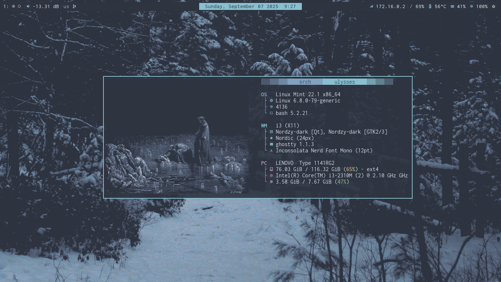
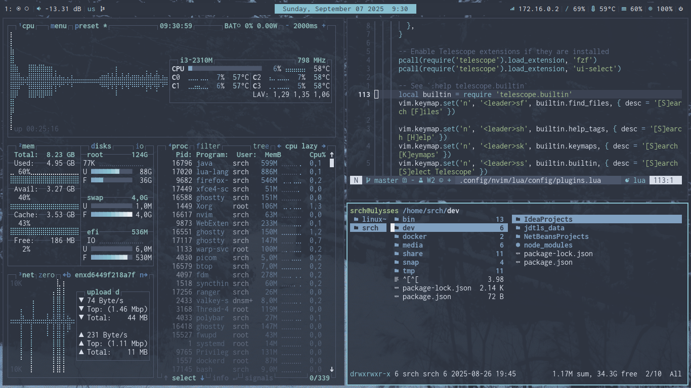
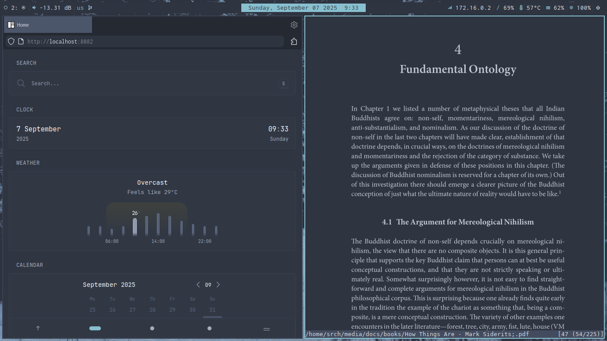

[Reddit Post](https://reddit.com/r/unixporn/comments/1nasetc/i3_my_current_i3wm_nord_rice/)

Note: Some of my configs are pretty specific for my device (e.g. I have a problem in my wi-fi so the polybar module for internet was addressed to my DNS)
